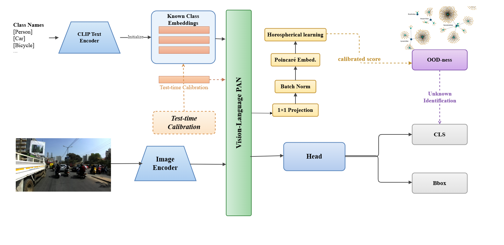

# HyperYOLO-World: Hyperspherical Open-World Object Detection

<p align="center">
  
</p>

**Few-shot open-world object detection** using von Mises-Fisher (vMF) distributions on the unit hypersphere, built on top of [YOLO-World](https://github.com/AILab-CVC/YOLO-World).

HyperYOLO-World extends YOLO-World with a hyperspherical projection head and vMF classifier for density-calibrated OOD (out-of-distribution) detection. Known objects are classified via learnable per-class concentration parameters on the unit sphere; unknown objects are detected when their maximum vMF log-likelihood falls below adaptive thresholds.

## Key Features

- **vMF Hyperspherical Classification** -- Projects visual features onto the unit hypersphere via BiLipschitz (spectral-normed) projectors. Classification uses vMF log-likelihood scores with learnable per-class kappa.
- **EMA Prototype Learning** -- Class prototypes are unit vectors updated via exponential moving average (no gradient instability).
- **Adaptive OOD Thresholds** -- Per-class thresholds calibrated from training statistics (mean - alpha * std), embedded in the checkpoint.
- **Incremental Few-Shot Learning (T1 -> T2)** -- Learns novel classes from few-shot data while preserving base-class knowledge using frozen prototypes and Gradient Projection Memory (GPM).
- **Procrustes-Aligned Prototype Initialization** -- Novel class prototypes are initialized via GW-OT optimization on CLIP embeddings, then Procrustes-rotated to align with trained base-class positions.
- **Multi-GPU DDP Training** -- Full distributed training support via `torchrun`.

## Architecture

```
Frozen YOLO-World (backbone + neck + head)
    |
    v
FPN features (P3: 384-d, P4: 768-d, P5: 768-d)
    |
    v
BiLipschitz Projectors (spectral norm + residual skip)
    |
    v
MLP Projection Head (64-d -> 64-d)
    |
    v
L2 Normalize -> Unit Hypersphere (S^63)
    |
    v
vMF Classifier: score_c = log Z_d(kappa_c) + kappa_c * mu_c^T * r
    |
    v
OOD Detection: max_c(score_c) < tau_c  ->  unknown
```

## Installation

### Prerequisites

- Linux with CUDA 12.1
- Conda (Miniconda or Anaconda)

### Setup

```bash
# Clone and enter repo

cd hypyolov

# Clone YOLO-World dependency (if not present)
git clone https://github.com/AILab-CVC/YOLO-World.git

# Run the install script (creates conda env, installs all dependencies)
bash setup/install_ovow.sh
```

> **Note:** The install script creates a conda environment named `hypyolo`.
> If you already have an environment (e.g. `ovow2`), update the env name in
> sbatch scripts or set `CONDA_ENV` before running.

### Verify Installation

```bash
conda activate hypyolo
python -c "import torch; print(f'PyTorch: {torch.__version__}')"
python -c "import mmcv; print(f'mmcv: {mmcv.__version__}')"
python -c "import detectron2; print(f'detectron2: {detectron2.__version__}')"
```

### Pretrained Weights

Download the YOLO-World v2 XL pretrained checkpoint:

```bash
# Place in project root
wget https://huggingface.co/wondervictor/YOLO-World/resolve/main/yolo_world_v2_xl_obj365v1_goldg_cc3mlite_pretrain-5daf1395.pth
```

## Dataset Preparation

Datasets go under `datasets/` with Pascal VOC format:

```
datasets/
  JPEGImages/          # All images
  Annotations/         # Pascal VOC XML annotations
  ImageSets/Main/
    IDD/
      t1.txt           # T1 train image list
      t2_10shot.txt    # T2 few-shot train list (10-shot)
      test.txt         # Test image list
      t1_classes.txt   # T1 class names (one per line)
      t2_classes.txt   # T2 novel class names (one per line)
  FewShot_Annotations/
    10shot/            # Filtered XMLs for few-shot training
  prototype/           # Generated prototype files (output of init_protos)
```

## Training Pipeline

The full pipeline runs in order: **init T1 protos -> T1 training -> init T2 protos -> T2 training**.

All commands support both direct shell execution and SLURM submission.

### Step 1: Initialize T1 Prototypes

Computes GW-OT optimized prototype directions on the unit sphere from CLIP text embeddings.

```bash
# SLURM
sbatch scripts/init_protos.sbatch t1

# Direct
conda activate hypyolo
bash scripts/init_protos.sh t1
```

Output: `datasets/prototype/init_protos_t1.pt`

### Step 2: T1 Base Training

Trains the hyperspherical projector and vMF classifier on all base classes.

```bash
# SLURM (2 GPUs, experiment name "vmf_v1")
sbatch scripts/train_hyp_ddp.sbatch t1 vmf_v1 2

# Direct (single GPU)
conda activate hypyolo
torchrun --nproc_per_node=1 dev_hyp_ddp.py \
    --config-file configs/IDD_HYP/base.yaml \
    --task IDD_HYP/t1 \
    --ckpt yolo_world_v2_xl_obj365v1_goldg_cc3mlite_pretrain-5daf1395.pth \
    --exp_name vmf_v1 \
    --wandb
```

Output: `IDD_HYP/t1/vmf_v1/model_final.pth`

### Step 3: Initialize T2 Prototypes

Computes novel class prototypes via GW-OT + Procrustes alignment to trained T1 positions.

```bash
# SLURM (uses default T1 checkpoint path)
sbatch scripts/init_protos.sbatch t2

# SLURM (explicit T1 checkpoint)
sbatch scripts/init_protos.sbatch t2 IDD_HYP/t1/vmf_v1/model_final.pth

# Direct
conda activate hypyolo
bash scripts/init_protos.sh t2 IDD_HYP/t1/vmf_v1/model_final.pth
```

Output: `datasets/prototype/init_protos_t2.pt`

### Step 4: T2 Few-Shot Training (with GPM)

Fine-tunes on few-shot novel class data. GPM bases are **auto-computed** from T1 if not already present.

The pipeline inside `train_hyp.sh`:
1. Checks for `gpm_bases.pt` next to the T1 checkpoint
2. If missing, runs `compute_gpm_bases.py` (~10 min) to extract base-class activation subspace
3. Starts T2 training with gradient projection protecting base-class conv weights

```bash
# SLURM (1 GPU, experiment name "vmf_t2_gw")
sbatch scripts/train_hyp_ddp.sbatch t2 vmf_t2_gw 1 IDD_HYP/t1/vmf_v1/model_final.pth

# Direct
conda activate hypyolo
bash scripts/train_hyp.sh t2 1 29500 vmf_t2_gw IDD_HYP/t1/vmf_v1/model_final.pth
```

Output: `IDD_HYP/t2/vmf_t2_gw/model_final.pth`

**sbatch arguments:** `<split> <exp_name> <num_gpus> <t1_checkpoint>`

### Evaluation

```bash
# T1 evaluation
sbatch scripts/test_hyp.sbatch IDD_HYP/t1 IDD_HYP/t1/vmf_v1/model_final.pth

# T2 evaluation
sbatch scripts/test_hyp.sbatch IDD_HYP/t2 IDD_HYP/t2/vmf_t2_gw/model_final.pth

# Direct
conda activate hypyolo
python test_hyp.py \
    --config-file configs/IDD_HYP/base.yaml \
    --task IDD_HYP/t2 \
    --ckpt IDD_HYP/t2/vmf_t2_gw/model_final.pth
```

### Quick Reference

| Step | SLURM Command | Output |
|------|---------------|--------|
| Init T1 protos | `sbatch scripts/init_protos.sbatch t1` | `datasets/prototype/init_protos_t1.pt` |
| T1 training | `sbatch scripts/train_hyp_ddp.sbatch t1 vmf_v1 2` | `IDD_HYP/t1/vmf_v1/model_final.pth` |
| Init T2 protos | `sbatch scripts/init_protos.sbatch t2` | `datasets/prototype/init_protos_t2.pt` |
| T2 training | `sbatch scripts/train_hyp_ddp.sbatch t2 vmf_t2_gw 1 <T1_CKPT>` | `IDD_HYP/t2/vmf_t2_gw/model_final.pth` |
| Eval T1 | `sbatch scripts/test_hyp.sbatch IDD_HYP/t1 <CKPT>` | stdout |
| Eval T2 | `sbatch scripts/test_hyp.sbatch IDD_HYP/t2 <CKPT>` | stdout |

## Configuration

Configs live in `configs/IDD_HYP/`:

| File | Purpose |
|------|---------|
| `base.yaml` | Detectron2 dataset config (shared) |
| `t1.yaml` | T1 class counts (PREV=0, CUR=8) |
| `t2.yaml` | T2 class counts (PREV=8, CUR=6) |
| `t1.py` | T1 YOLO-World + vMF hyperparameters |
| `t2.py` | T2 YOLO-World + vMF + GPM hyperparameters |

Key hyperparameters in `t2.py`:

```python
hyp_config = dict(
    embed_dim=64,            # Must match T1
    vmf_loss_weight=1.5,     # vMF loss multiplier
    kappa_init=10.0,         # Initial concentration
    ema_alpha=0.95,          # Prototype EMA decay
    use_gpm=True,            # Gradient Projection Memory
    gpm_threshold=0.97,      # Variance threshold (0.97=stable, 0.90=plastic)
)
```

## Project Structure

```
hypyolov2/
  dev_hyp_ddp.py             # Main training script (DDP)
  test_hyp.py                # Evaluation script
  init_prototypes.py         # GW-OT + Procrustes prototype init
  compute_gpm_bases.py       # Extract GPM bases from trained T1
  core/
    hyp_customyoloworld.py   # HypCustomYoloWorld model wrapper
    gpm.py                   # Gradient Projection Memory
    hyperbolic/
      projector.py           # BiLipschitz projector + vMF classifier
    calibrate_thresholds.py  # Adaptive OOD threshold calibration
    eval_utils.py            # Evaluation utilities
  configs/IDD_HYP/           # Task configs
  scripts/                   # SLURM sbatch + shell launchers
  setup/                     # Installation script
  YOLO-World/                # YOLO-World dependency (git submodule)
```

